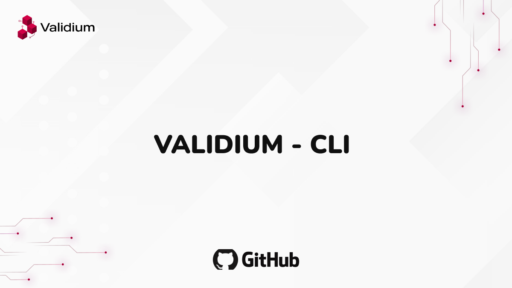

---
Deploy a smart contract to Validium using the validium-cli in under 5 minutes
---

# Deploy using Validium CLI

---

## 

This Page shows you how to deploy and interact with a smart contract on Validium in less than 5 minutes. It will help you get familiar with the Validium smart contract development and deployment process using validium-cli.

Content:

- Build a smart contract named Counter.
- Deploy the smart contract to the Validium Devnet.
- Interact with the contract using scripts.

## Prerequisites

1. Before you start, make sure that you’ve configured the [Validium Devnet in your wallet](../../connect-to-validium.md#add-validium-to-your-metamask-wallet).
2. Have at least 0.5 Validium Devnet VLDM. If you need more, use one of the [faucets](https://devnet.faucet.validium.network/).

## `validium-cli`

Syntax:

```
npx validium-cli create <project-name>
```

### Create Validium Project

1. Use the command below to create a project

```git
npx validium-cli create my-project
```

2. Move to the just created project:

```
cd my-project
```

3. Create a `.env` file and add these environment variables:

```
WALLET_PRIVATE_KEY=
INFURA_API_KEY=
```

Add your account wallet private key here using which you want to deploy and interact with your contract. Also, you will need the [Infura](https://developer.metamask.io/login) API key with the Holesky network enabled (the Underlying Ethereum network).&#x20;

### Review the Smart Contract

Review the contract inside `contracts` folder:

Counter.sol

```solidity
// SPDX-License-Identifier: MIT
pragma solidity ^0.8.17;

contract Counter {
    uint256 public count = 0;

    // Events
    event Greet(string);
    event CountUpdated(uint256);

    constructor() {
        // initializes the contract with a welcome message
        emit Greet("Welcome to Validium Network!");
    }

    function increment() public {
        count += 1;
        emit CountUpdated(count);
    }

    function decrement() public {
        require(count > 0, " UNDERFLOW: CANNOT DECREASE ANYMORE!");
        count -= 1;
        emit CountUpdated(count);
    }

    function getCount() public view returns (uint256) {
        return count;
    }
}
```

The Solidity smart contract contains three functions:

- `increment` increases the value of the count state by 1 and emits the `CountUpdated` event.
- `decrement` decreases the value of the count state by 1 and emits the `CountUpdated` event.
- `getCount` returns the current value of the count state.

Validium is EVM compatible. You can write smart contracts with Solidity or Vyper and use existing popular libraries like OpenZeppelin, just like on Ethereum.

### Compile and Deploy the Smart Contract

1. Use this command to compile the smart contract:

```
npx validium-cli compile
```

It will compile and generate an artifacts folder named `artifacts-zk` .\
Logs:

```
$ npx validium-cli compile

Setting up compilation environment...

Compiling contracts for ZKsync Era with zksolc v1.5.7 and zkvm-solc v0.8.17-1.0.1
Compiling 1 Solidity file
Successfully compiled 1 Solidity file
```

2. Go to `deploy.ts` file inside `deploy` folder:

deploy.ts

```typescript
import * as hre from "hardhat";
import { Deployer } from "@matterlabs/hardhat-zksync";
import { getWallet, verifyContract, verifyEnoughBalance } from "./utils";
import { ethers } from "ethers";

const deployContract = async (
  contractArtifactName: string,
  constructorArguments?: any[]
) => {
  console.log(`\nStarting deployment process of "${contractArtifactName}"...`);

  const wallet = getWallet();
  const deployer = new Deployer(hre, wallet);
  const artifact = await deployer
    .loadArtifact(contractArtifactName)
    .catch((error) => {
      if (
        error?.message?.includes(
          `Artifact for contract "${contractArtifactName}" not found.`
        )
      ) {
        console.error(error.message);
        throw `⛔️ Please make sure you have compiled your contracts or specified the correct contract name!`;
      } else {
        throw error;
      }
    });

  // Estimate contract deployment fee
  const deploymentFee = await deployer.estimateDeployFee(
    artifact,
    constructorArguments || []
  );
  console.log(
    `Estimated deployment cost: ${ethers.formatEther(deploymentFee)} ETH`
  );

  // Check if the wallet has enough balance
  await verifyEnoughBalance(wallet, deploymentFee);

  // Deploy the contract to ZKsync
  const contract = await deployer.deploy(artifact, constructorArguments);
  const address = await contract.getAddress();
  const constructorArgs = contract.interface.encodeDeploy(constructorArguments);
  const fullContractSource = `${artifact.sourceName}:${artifact.contractName}`;

  // Display contract deployment info
  console.log(`\n"${artifact.contractName}" was successfully deployed 🎉:`);
  console.log(` - Contract address: ${address}`);
  console.log(` - Contract source: ${fullContractSource}`);
  console.log(` - Encoded constructor arguments: ${constructorArgs}\n`);
  console.log(
    ` - See on Validium Block Explorer: https://devnet.explorer.validium.network/address/${address}\n`
  );

  if (hre.network.config.verifyURL) {
    console.log(`Requesting contract verification...`);
    await verifyContract({
      address,
      contract: fullContractSource,
      constructorArguments: constructorArgs,
      bytecode: artifact.bytecode,
    });
  }

  return contract;
};

export default async function () {
  const contractArtifactName = "Counter";
  const constructorArguments: any[] | undefined = [];
  await deployContract(contractArtifactName, constructorArguments);
}
```

Update the following:

- `contractArtifactName` (check generated `artifacts-zk` folder, usually the same as the contract file name)
- `constructorArguments` (if providing any arguments to the constructor)

3. Deploy to Validium Devnet:

syntax:

```
npx validium-cli deploy <script-file>
```

If `<script-file>` is not provided, then by default it will be `deploy.ts` from the `deploy` folder.

```
npx validium-cli deploy
```

This will deploy the compiled contract to the Validium Devnet.

Logs:

```
$ npx validium-cli deploy

Setting up deployment environment...

Starting deployment process of "Counter"...
Estimated deployment cost: 0.000019009462581388 ETH

"Counter" was successfully deployed 🎉:
 - Contract address: 0xB168e33f0d03666590be03AdeAc92Bd76b3229af
 - Contract source: contracts/Counter.sol:Counter
 - Encoded constructor arguments: 0x

 - See on Validium Block Explorer: https://devnet.explorer.validium.network/address/0xB168e33f0d03666590be03AdeAc92Bd76b3229af

```

&#x20;Piece of cake right? 🎊

### Check the Contract in Validium Block Explorer

Use the contract address from the deployment logs to see the deployed contract on the [Validium Block Explorer](https://devnet.explorer.validium.network/) or use the link from the logs directly.

<figure><figcaption><p>Deployed contract on Validium Block Explorer</p></figcaption></figure>

You can also move to the Events tab and see the `Greet` event emitted through the constructor as a result of deployment:

<figure><figcaption><p>Events tab showing the Greet Event value in Text format</p></figcaption></figure>

### Interact with the Deployed Contract

1. Go to `interact.ts` file inside `deploy` folder:

interact.ts

```typescript
import * as hre from "hardhat";
import { ethers } from "ethers";
import { getWallet } from "./utils";

// Address of the contract to interact with
const CONTRACT_ADDRESS = "";
const CONTRACT_NAME = "Counter";

if (!CONTRACT_NAME) throw "⛔️ Provide name of the contract to interact with!";
if (!CONTRACT_ADDRESS)
  throw "⛔️ Provide address of the contract to interact with!";

// An example of a script to interact with the contract
export default async function () {
  console.log(`Running script to interact with contract ${CONTRACT_ADDRESS}`);

  // Load compiled contract info
  const contractArtifact = await hre.artifacts.readArtifact(CONTRACT_NAME);

  // Initialize contract instance for interaction
  const contract = new ethers.Contract(
    CONTRACT_ADDRESS,
    contractArtifact.abi,
    getWallet() // Interact with the contract on behalf of this wallet
  );

  async function increment() {
    // Increment the counter
    console.log("Calling increment...");
    const incrementTx = await contract.increment();
    console.log("Tx hash:", incrementTx.hash);
    await incrementTx.wait();
    console.log("Incremented!");
  }
  async function decrement() {
    // Decrement the counter
    console.log("Calling decrement...");
    const decrementTx = await contract.decrement();
    console.log("Tx hash:", decrementTx.hash);
    await decrementTx.wait();
    console.log("Decremented!");
  }

  async function fetchStoredInteger() {
    // Fetch the current stored integer
    console.log("Calling getCount...");
    const currentStoredInteger = await contract.getCount();
    console.log(`Count: ${currentStoredInteger}`);
  }

  //   listen to events-
  contract.on("CountUpdated", (newValue) => {
    console.log(`Event - CountUpdated: ${newValue}`);
  });

  await increment();
  await increment();
  await decrement();
  await fetchStoredInteger();
}
```

Update the following:

- `CONTRACT_ADDRESS` (copy the contract address from the deployment logs and paste it here)
- `CONTRACT_NAME` (contract artifact name from `afticats-zk` folder)

Run the interact script:

syntax:

```
npx validium-cli interact <script-file>
```

If `<script-file>` is not provided, then by default it will be `interact.ts` from the `deploy` folder.

```
npx validium-cli interact
```

The interact script above triggers three transactions (two `increment` and one `decrement`) and one fetch (`getCount`) to the deployed contract. It also listens to the `CountUpdated` event when emitted.

Logs:

```
$ npx validium-cli interact

Running script to interact with contract 0xB168e33f0d03666590be03AdeAc92Bd76b3229af
Calling increment...
Tx hash: 0x8a1377c8076d07e22d0aec5e18e74e0bd265c768b59605524d3ce1df9ade8b43
Incremented!
Calling increment...
Event - CountUpdated: 1
Tx hash: 0x4de20aeecb1871e53ad6394f126cbed431e6d9b630cfe6a8588c133a36bae8df
Incremented!
Calling decrement...
Event - CountUpdated: 2
Tx hash: 0x5cbd6e4594e8f05db6b779897dc13acb3e2c0e01a86d23b8e2d826c646de4315
Decremented!
Calling getCount...
Event - CountUpdated: 1
Count: 1
```

Check the transactions in Validium Block Explorer as well:

<figure><figcaption><p>Three transactions which was triggered from the interact.ts script</p></figcaption></figure>

### Takeaways <a href="#takeaways" id="takeaways"></a>

- **`validium-cli`:** This CLI tool streamlines deployment and facilitates seamless interaction with the Validium Network.
- **EVM-compatibility**: Validium is EVM-compatible and you can write smart contracts in Solidity or Vyper as in Ethereum.
- **Custom compilers**: smart contracts deployed to Validium must be compiled with the customs compilers: `zksolc` for Solidity and `zkvyper` for Vyper.

### Next steps <a href="#next-steps" id="next-steps"></a>

- Follow the same above steps to deploy your contract, changes can be made to `interact.ts` file and use your methods from the contract.
- Continue learning by [Deploy using Quickstart Repository](deploy-using-quickstart-repository.md).
